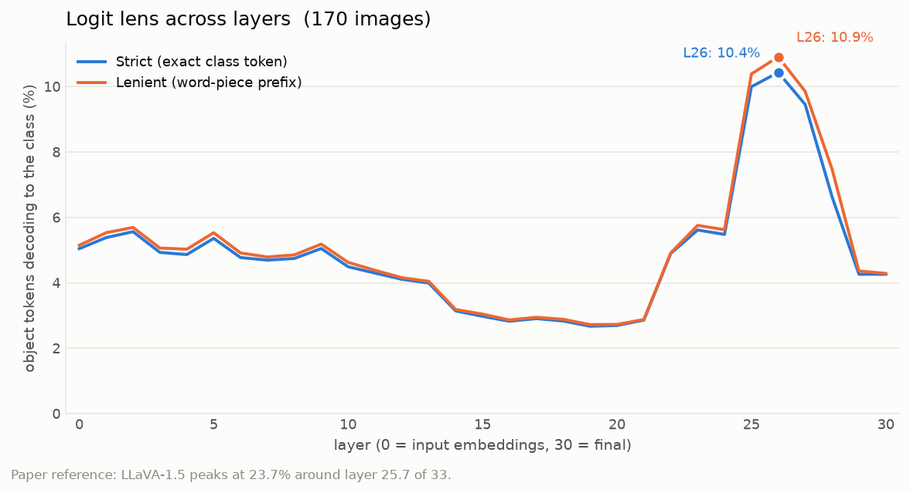
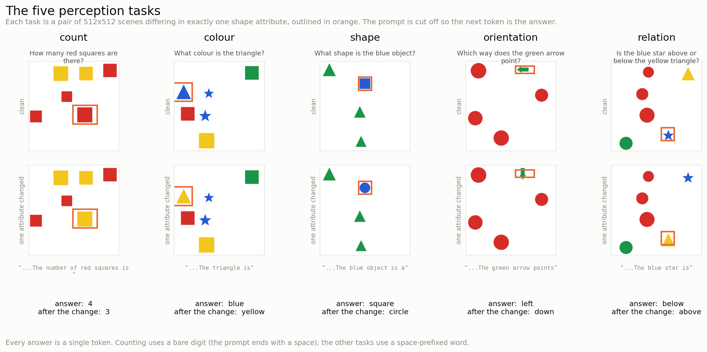
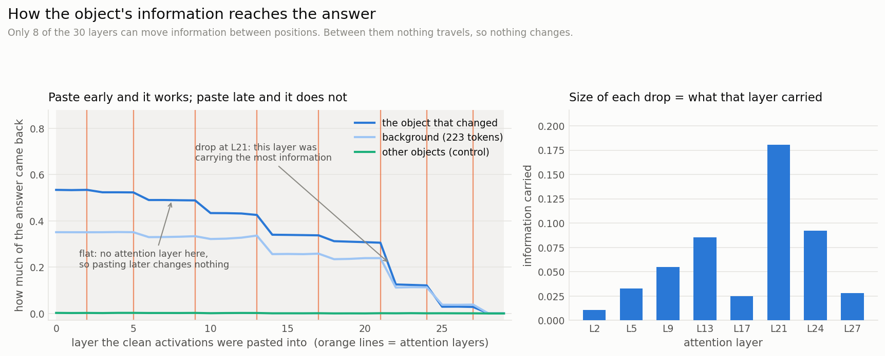
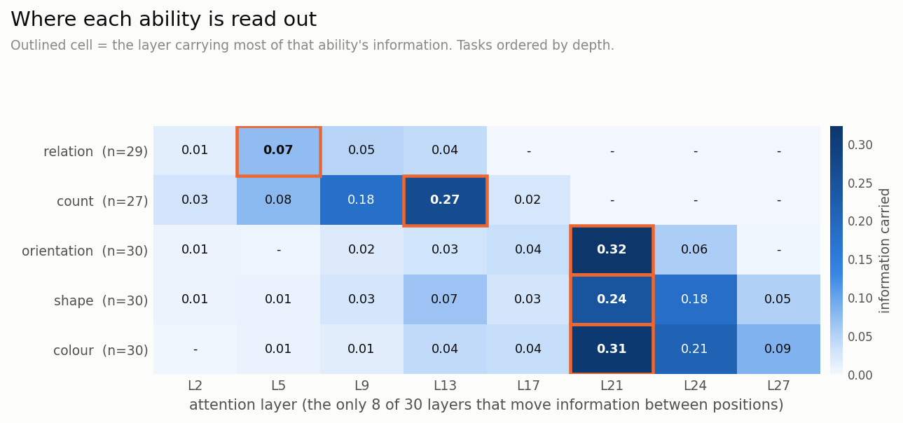

# Interpretability experiments on LFM2.5-VL-3B

Two experiments on the vision language model [`LiquidAI/LFM2.5-VL-3B`](https://huggingface.co/LiquidAI/LFM2.5-VL-3B).

1. **Replication.** Reproducing [Neo et al., ICLR 2025](https://arxiv.org/abs/2410.07149) on this model. Their code targets LLaVA, which has a very different architecture, so this is a reimplementation rather than a config change.
2. **Perception probing.** A new experiment that finds where in the network individual perceptual abilities are computed: counting, colour, shape, orientation, and spatial relation.

Everything runs from one script. The second experiment needs no dataset download.

---

## The model

Two things about LFM2.5-VL-3B shaped how both experiments had to be built.

**Only 8 of its 30 language model layers use attention** (layers 2, 5, 9, 13, 17, 21, 24, 27). The other 22 are short convolutions that only see 2 positions back. Attention is therefore the only thing that can move information between distant positions in the sequence. This matters a lot for the results.

**The number of visual tokens changes with image shape.** The projector merges each 2x2 block of patches into one token, so an image becomes a grid of (height/32) by (width/32) tokens, somewhere between 64 and 256. A 640x480 photo becomes a 13x18 grid of 234 tokens. LLaVA always has 576 tokens in a fixed 24x24 grid, so all the patch to token mapping had to be recomputed per image.

---

## Experiment 1: Replication

Three measurements from the paper, run on COCO.

**Logit lens.** Decode each visual token through the model's own output weights at every layer and check whether it matches the object's class name.

| Model | Best layer hit rate | Peak layer |
|---|---|---|
| LLaVA-1.5-7B (paper) | 23.7% | 25.7 of 33 |
| Qwen2VL-2B (paper) | 6.5% | 25.1 of 29 |
| LFM2.5-VL-3B (this run) | 19.1% | 26 of 30 |



This reproduces. The peak sits at the same relative depth as in both models the paper tested, and the value lands between them. Measured on 170 COCO validation images; 124 of them show the effect at some layer.

**Token ablation.** Replace visual token embeddings with the mean visual token and see how many correct answers break. Measured on the paper's 100 curated VQA questions, 72 of which the model answers correctly to begin with.

| What was replaced | Tokens | Answers destroyed |
|---|---|---|
| Object plus 1 cell buffer | 22 | 18.1% |
| 20 random tokens | 20 | 1.4% |
| 20 top integrated gradients tokens | 20 | 13.9% |

Object localisation reproduces: replacing the object's tokens breaks about 13 times more answers than replacing the same number of random tokens. One thing does not reproduce. In the paper the object mask beats integrated gradients at a matched token count. Here integrated gradients is close behind and beats the object mask in some settings.

**Attention knockout.** Block attention from chosen tokens to the answer position. Relative accuracy, where 1.00 means no effect.

| From, to | early | mid | late | all layers |
|---|---|---|---|---|
| object+1, to answer | 0.99 | 0.97 | 0.94 | 0.93 |
| object+2, to answer | 0.99 | 0.96 | 0.92 | 0.89 |
| object+1, to last visual row | 0.99 | 0.99 | 1.00 | 0.97 |

Two of the paper's findings hold in direction. Blocking hurts more in late layers than early ones, and blocking anything to the last row of visual tokens does nothing, which is the paper's evidence against a summarisation step. The size of the effect is much smaller than the paper reports, which is expected because knockout can only reach 8 of the 30 layers here.

---

## Experiment 2: Where perceptual abilities are computed

The replication locates object identity but cannot separate individual abilities, because COCO labels are object classes and its images cannot be changed in a controlled way.

This experiment generates its own scenes instead. Every object's colour, shape, size, position and orientation is known exactly, so any single one can be changed while everything else stays identical.



Each sample is a **pair** of 512x512 scenes that differ in exactly one shape attribute. The question is cut off mid sentence so the model's next token is the answer, and every answer is a single token.

### Method: activation patching

Run the clean scene (answer "4") and the changed scene (answer "3"). Then run the changed scene again, but at one layer, overwrite the activations at the changed object's token positions with the ones from the clean run. Does the model go back to saying "4"?

Recovery is 0 if the patch did nothing and 1 if it fully restored the clean answer. Repeat once per layer, for all 30 layers.

Patching is used rather than attention knockout because it edits the residual stream between layers, so it works the same on convolution and attention layers and reaches all 30. Knockout only reaches the 8 attention layers.

### Result 1: information moves only at attention layers



Recovery holds flat, then drops, then holds flat again. The drops land exactly on the 8 attention layers.

The reason is that the patched information sits at the object's position, around 250 tokens away from where the answer is produced, and only attention can carry it that far. Pasting at layer 6, 7 or 8 gives the same result because no attention layer sits between them. The size of each drop measures how much of the answer that layer was carrying. After layer 27, the last attention layer, patching the object does nothing at all.

### Result 2: different abilities are read out at different depths



| Task | Read out at | Recovery, object | Recovery, other objects |
|---|---|---|---|
| spatial relation | layer 5 | 0.19 | 0.003 |
| counting | layer 13 | 0.60 | 0.013 |
| orientation | layer 21 | 0.50 | 0.001 |
| shape | layer 21 | 0.64 | 0.001 |
| colour | layer 21 | 0.73 | 0.002 |

Simple spatial layout is resolved early. Counting is in the middle, and is finished by layer 17, after which the visual tokens no longer matter to it. Binding an attribute to a specific object happens latest. Each task uses separate images and separate samples, so this ordering was not built into the design.

The last two columns are the control. Patching the object that changed recovers 0.19 to 0.73. Patching the other objects in the same scene recovers 0.001 to 0.013. That rules out the possibility that disturbing any visual token would move the answer.

Based on 146 minimal pairs, roughly 30 per task.

### Baseline accuracy

Localisation only means something where the model is right, so accuracy was measured first and used to gate the rest.

| Task | Accuracy |
|---|---|
| relation | 100% |
| count | 90% |
| orientation | 100% |
| shape | 100% |
| colour | 100% |

Four of the five tasks are at ceiling at every difficulty level, including crowded overlapping scenes. Counting is the only one with errors. 146 of 150 pairs were answered correctly on both scenes and were usable for patching.

---

## Running it

Requires Python 3.10 or newer. A GPU is needed for the real runs, but not for the tests.

```bash
cd lfm2vl-interp
python -m venv .venv
.venv/bin/activate          # Windows: .venv\Scripts\activate
pip install -r requirements.txt
```

`transformers==5.8.1` is required. The checkpoint uses conventions that earlier versions cannot load at all.

**Experiment 2 (perception).** Start here. It generates its own images, so there is nothing to download.

```bash
python run_all.py --suite perception --preset standard
```

Takes about 1.5 hours on an A100. Use `--preset quick` for a 20 minute version that runs every stage on fewer samples.

**Experiment 1 (replication).** This one needs COCO. The script downloads only the images the filters actually select, about 0.6 GB rather than the full 19 GB.

```bash
python run_all.py --suite replication --preset standard
```

Both write to `outputs/`, are resumable if interrupted, and finish by zipping the results with instructions for copying them back.

**Tests.** These run on CPU against a small randomly initialised model with the same architecture. No GPU and no model weights needed.

```bash
pytest
```

**Individual stages.** Any stage can be run on its own:

```bash
python scripts/synthetic/build_dataset.py --config configs/synthetic.yaml
python scripts/synthetic/baseline.py      --config configs/synthetic.yaml
python scripts/synthetic/patching.py      --config configs/synthetic.yaml
python scripts/synthetic/analyze.py       --config configs/synthetic.yaml
```

Add `--tiny` to any of them to run against the small test model instead of downloading the real one.

---

## What is in the repo

```
lfm2vl-interp/
  run_all.py              one entry point for both experiments
  configs/                settings for each experiment
  src/
    hooked_lfm2vl.py      model wrapper: ablation, attention knockout, capturing activations
    patching.py           activation patching and the recovery metric
    synthetic.py          scene generation and minimal pairs
    tasks.py              the five tasks: prompts, answers, how each pair is built
    geometry.py           mapping image regions to visual token positions
    logit_lens.py         decoding activations through the output weights
    dataviewer.py         per sample HTML viewer
    plots.py, report.py   figures and the results report
  scripts/                one script per stage
  tests/                  231 tests, no GPU needed
```

Two useful outputs beyond the numbers:

- **`viewer.html`**, produced by the perception run. Shows every sample: both scenes side by side, the changed shape outlined, the token grid overlay, the exact prompt, and the model's prediction. It works before the model has run, which is how you check the generated scenes are correct before spending GPU time.
- **A project page** combining both experiments with all figures and an interactive logit lens, built with `python scripts/build_project_page.py --results ../results --out ../results/index.html`.

---

## Things to be aware of

- The synthetic tasks are too easy for this model. Four of five sit at 100% at every difficulty level, so the difficulty ladder did not measure anything. Finding failure modes would need harder scenes.
- The linear probe results are weak. Each probe is fitted on about 21 samples against 2048 features, which can separate any labelling, and tested on 9. Treat those layer numbers as rough.
- Patching recovery always declines with depth, for reasons built into the method. Only the differences between token groups and the steps between layers are meaningful, not the absolute level.
- Attention knockout and patching disagree about whether the object tokens matter. The likely explanation is that the information reaches the answer through the question tokens rather than directly, since patching the question tokens recovers 0.33 even though they are identical in both runs. This was not tested. The experiment that would settle it is blocking attention from the object tokens to the question tokens.
- The replication's ablation was only run in the VQA setting. The generative and polling settings were not run.

---

## Reference

Clement Neo, Luke Ong, Philip Torr, Mor Geva, David Krueger, Fazl Barez.
*Towards Interpreting Visual Information Processing in Vision-Language Models.* ICLR 2025.
[arXiv:2410.07149](https://arxiv.org/abs/2410.07149)
